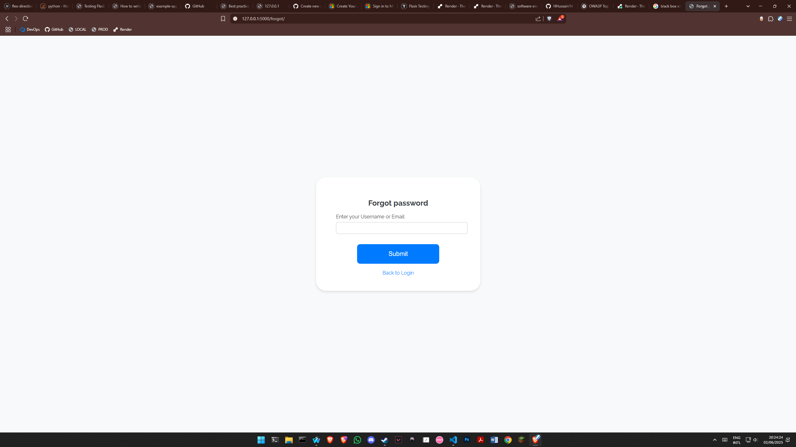
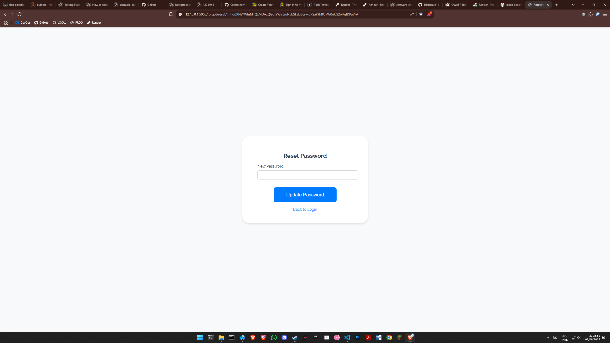

# Table of Contents

- [Introduction](#introduction)
  - [Problem Statement](#problem-statement)
  - [Project Scope Statement](#scope-statement)
  - [Entity Relationship Diagram](#database-design-overview)
  - [Annotated Screenshots](#annotated-screenshots)
- [Running the Application](#running-the-application)
- [Testing the Application](#testing-the-application)
  - [Test Strategy](#test-strategy)
  - [What is being Tested](#what-is-being-tested)
  - [Running the Tests](#running-the-tests)

# Introduction

(**Note:** This is a fictional scenario for educational purposes)

## Problem Statement

1. **Problem:** Fujitsu employees do not have an efficient system in place to raise support tickets with IT Helpdesk raising inefficiencies in tracking and solving the issues.

2. **Background:** Fujitsu does not have a process that allows employees to request support for common issues with their devices. Communication is primarily done through Microsoft Teams or Microsoft Outlook, this causes frequent delays and miscommunication, which makes the IT Helpdesk inconsistent.

3. **Relevance:** Inefficient ticket management can lead to slow resolution of issues, decreasing employees productivity as their operations are disrupted. The inconvenience of the ticket management system can also reduce user satisfaction leading to decreased morale and productivity.

4. **Objectives:** This project aims to develop a web based IT Support Ticket Management System using Flask, SQLite, and Python. The application will include features for Creating, Updating, and Managing support tickets, with role-based access controls for users and administrators. This project aims to streamline the ticket management system and provide improved resolution times, enhance user satisfaction, and create a knowledgebase with the record details being used for future training.

## Scope Statement

1. **Project Name:** IT Support Ticket Management System.

2. **Scope Overview:** This project focuses on delivering a web based IT Support Ticket Management System to improve ticket resolution. The system will provide a user friendly interface for both **users** and **administrators** allowing effective ticket creation, update, and tracking.

3. **In Scope:**

   - User Authentication and Authorization for 2 users:

     - Basic User: Limited CRUD operations (Excluding Update and Delete)

     - Administrator: Full CRUD operations (Excluding Delete)

   - Ticket management features:

     - Creation, update, and viewing of support request tickets.

     - Validation to ensure accurate and consistent support request tickets.

     - Tickets cannot be explicitly deleted as they are used for tracking recurring issues, identifying trends, or patterns. Instead, tickets can be marked as 'Cancelled' or 'Resolved' to simulate deletion while preserving their data for future analysis.

   - Comments:

     - Users can add comments to the tickets to record a conversation and information associated with the issue.

     - Administrators can view and respond to comments made on any support request ticket.

   - Database Integration:

     - Implementation of an SQLite database to store user information, tickets, and comments.

     - Relationship between the tables to ensure data integrity.

   - Code and Documentation:

     - Modularized and clean code that adheres to industry standards.

     - Comprehensive documentation with setup and usage instructions.

     - Annotated screenshots of the running application.

4. **Out of scope:**

   - Integrations with third party systems.

   - Advanced analytics or reporting tools for ticket trends and patterns.

5. **Assumptions:**

   - Users will have access to the internet and a browser to use the system.

   - Initial test data (10 records for each table) will be automatically generated for demonstration purposes.

6. **Constraints:**

   - The system will utilize SQLite which is a small scale database suitable for small-scale operations.

   - The styling of the application will be basic since the academic requirements do not grant marks for design or UX.

## Database Design Overview:


## Annotated Screenshots

This section contains screenshots and details how to navigate through the application.

1. When the application is first launched the user needs to log in.
   

2. Depending on the role of the user the home screen can appear with different buttons and options (The first image is the home screen for the Basic User and the second image is for the Administrator)
   
   

3. The `New Ticket` button redirects user to the following screen where the user can enter the details for the request ticket.
   

4. Once a new ticket has been created it redirects the user automatically to a dynamically rendered screen of the record (The Edit Ticket button is visible since the Administrator account is used)
   

5. The `Edit Ticket` button shows this screen to the administrator allowing him to edit the record itself.
   

6. The `View my tickets` button redirects the user to a screen where they can see the support request tickets they have created.
   

7. The `View all tickets` button allows an administrator to view all the tickets in the database.
   

8. The `Add a new user` button allows an administrator to add a new user to the user table allowing them to access the application.
   

9. The `Forgot password?` link allows the user to enter their email and reset their password if an account exists.
   

10. If the `Email` or `Username` exists in the database you will receive an email with a link to reset your password.
    

# Running the application

1. Create a virtual environment: `python -m venv venv`

2. Activate the virtual environment.

3. Install dependencies: `pip install -r requirements.txt`

4. Create a `.env` file and add any value e.g. `SECRET_KEY = 'flask_secret_key_123'`

5. Run the application in the terminal: `python app.py`

6. The default administrator account's details are:

```js
username: admin;
password: admin123;
```

# Testing the Application

## Test Strategy

This project uses a **Black-Box End-to-End (E2E) Testing Strategy** implemented with **[Playwright](https://playwright.dev/)**.

E2E tests simulate real user interactions with the web application to ensure that critical user journeys behave as expected, from login to ticket management and logout.

This type of testing ensures:

- The application behaves correctly from the user's perspective.
- All integrated components (frontend, backend, database) work together.
- The UI responds correctly to inputs, actions, and expected flows.

End-to-End tests were chosen to validate the **entire flow** of the application because:

- The system relies heavily on user roles (admin and users).
- It includes form submissions, navigation, flash messages, and database updates.
- It's critical to ensure routing and Role-Based Access (RBAC) works correctly.

## What is being Tested

The automated tests simulate and verify the following scenarios:

- **Login** with valid credentials
- **Viewing tickets** as an admin or user
- **Creating a new ticket**
- **Editing a ticket’s status and description**
- **Adding comments to a ticket**
- **Adding a new user (admin only)**
- **Logging out**

These tests run in the GitHub Workflow, a Virtual Environment and a new Database is created for each run to avoid conflicts or duplication.

## Running the Tests

1. Open the terminal and enter: `cd playwright_automated_tests`
2. Run `npm install`
3. Run `npx playwright install`
4. Run the tests by: `npx playwright test`
5. The results are displayed in the terminal, in the `./playwright_automated_tests/summary.json`, and can be seen by entering the following command in the terminal: `npx playwright show-report`
