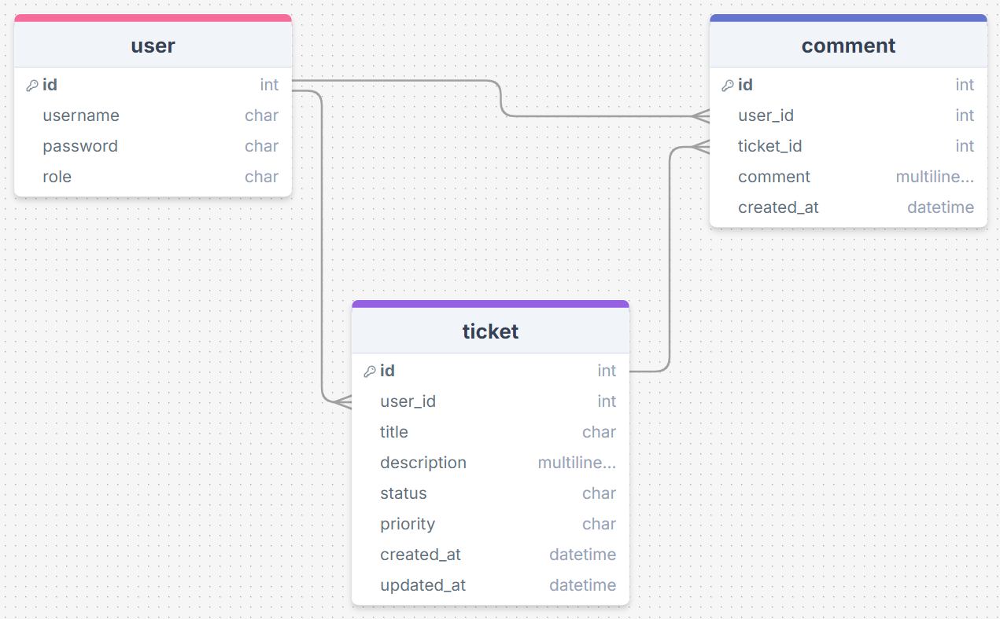
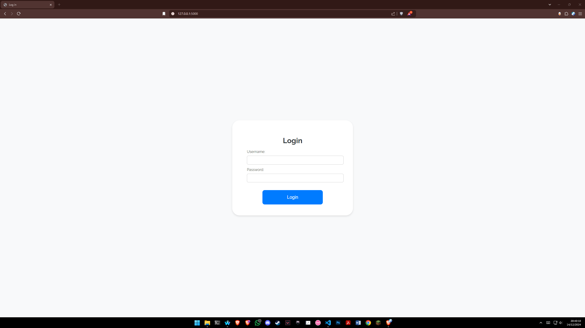
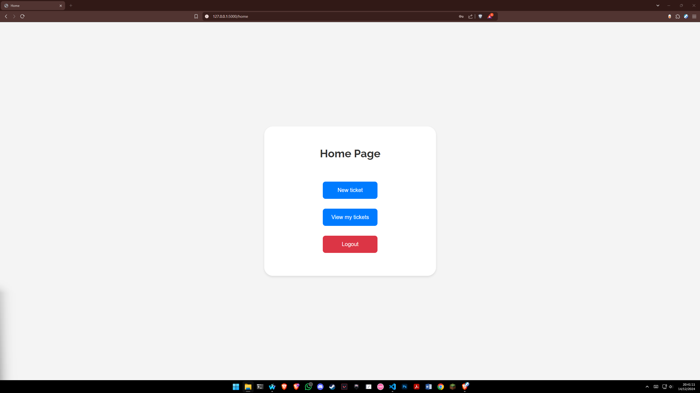
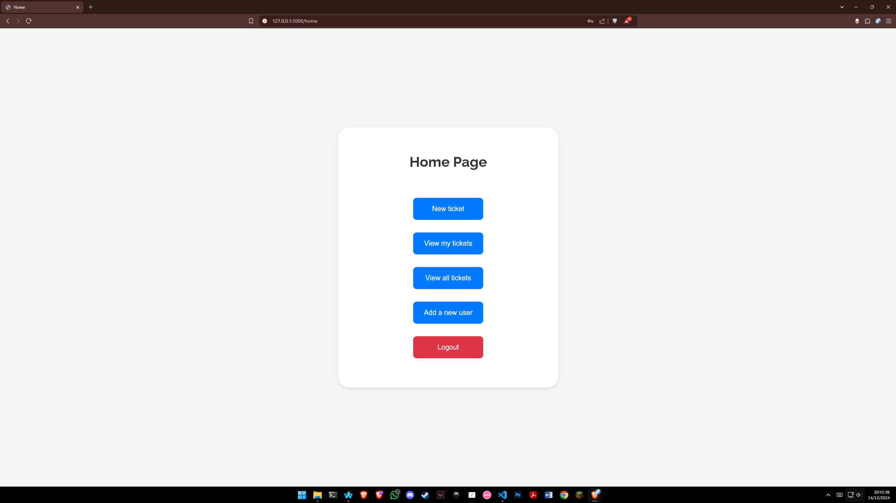
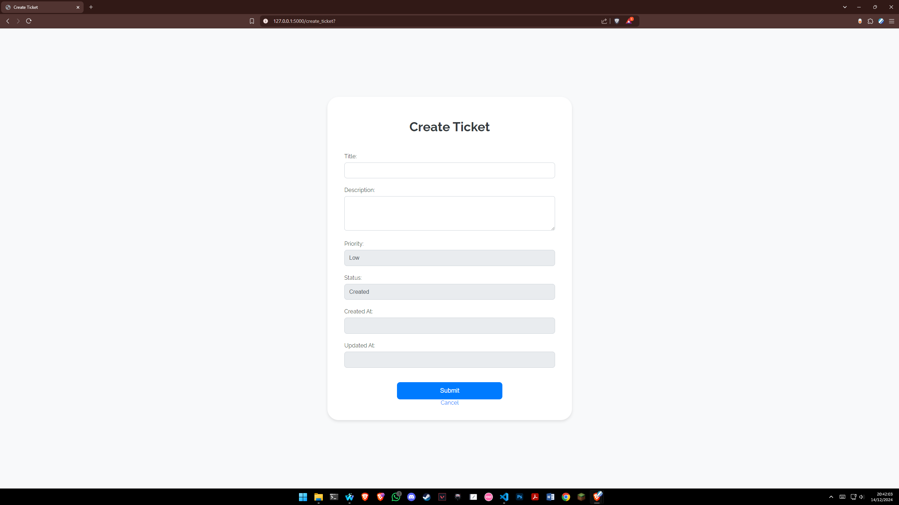
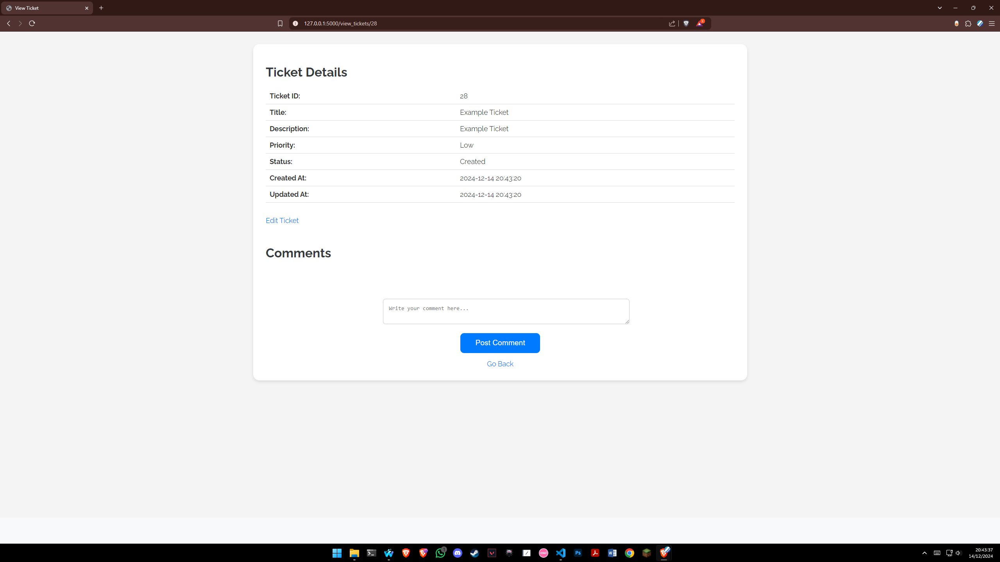
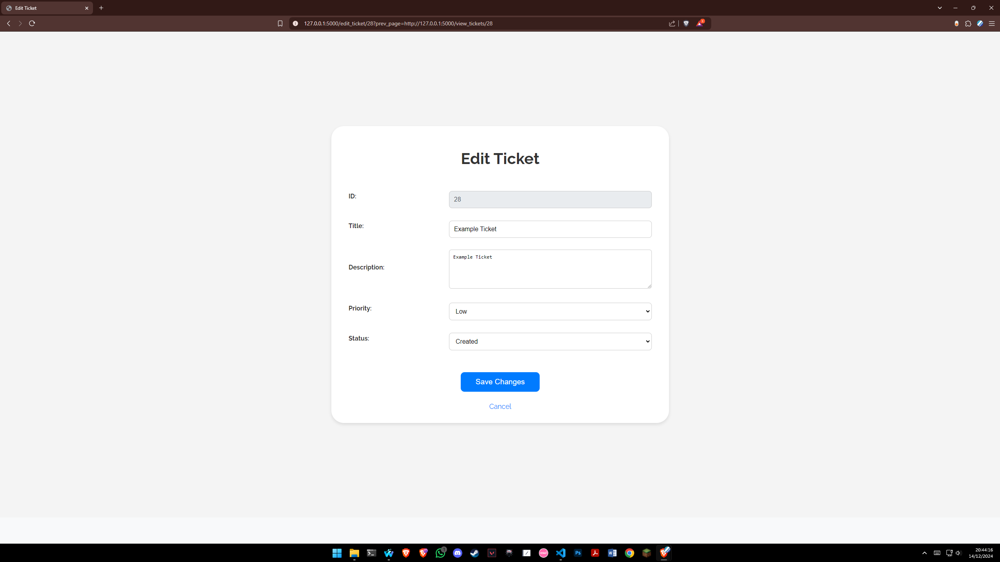
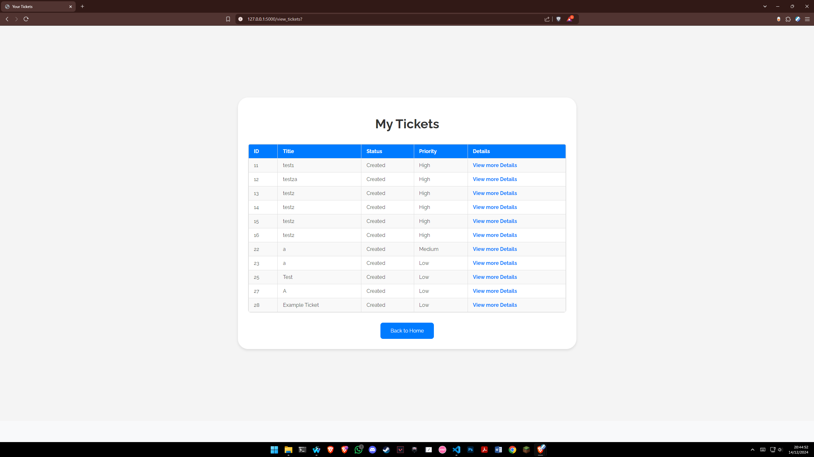
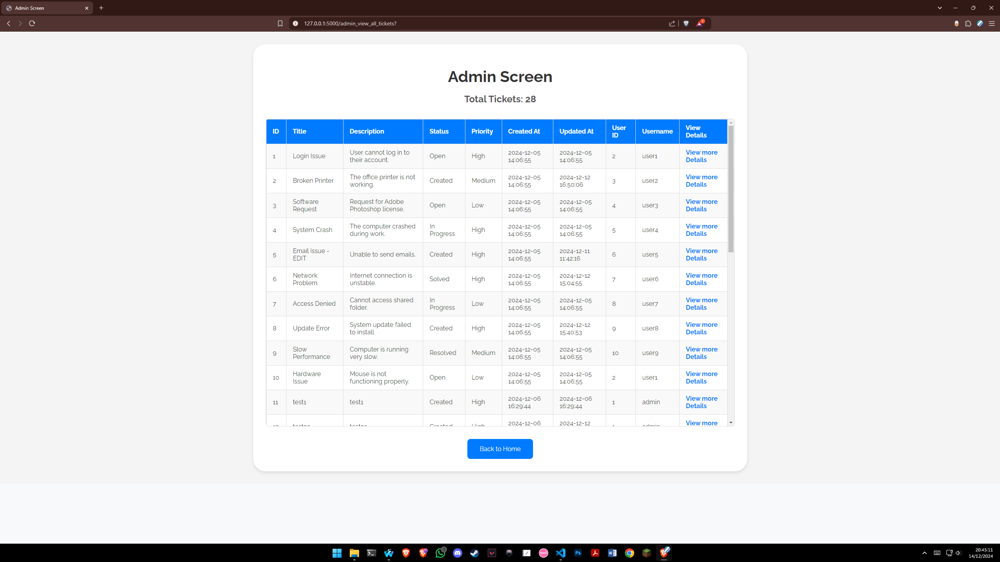
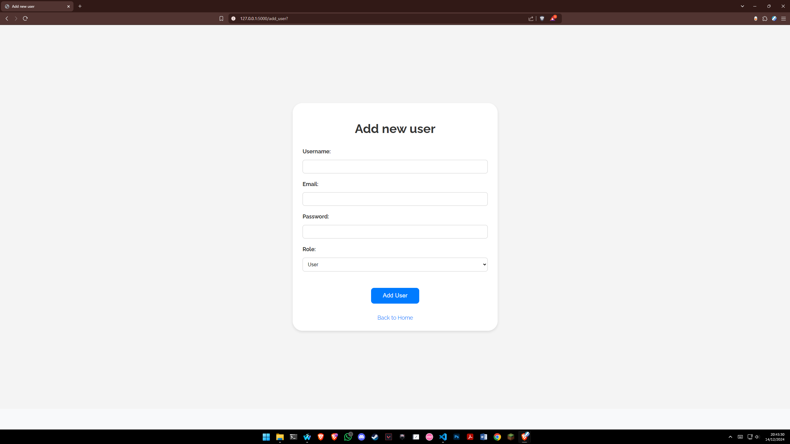

# Table of Contents

- [Introduction](#introduction)
  - [Problem Statement](#problem-statement)
  - [Project Scope Statement](#scope-statement)
  - [Entity Relationship Diagram](#database-design-overview)
  - [Annotated Screenshots](#annotated-screenshots)
- [Running the Application](#running-the-application)
- [Testing the Application](#testing-the-application)

# Introduction

(**Note:** This is a fictional scenario for educational purposes)

## Problem Statement

1. **Problem:** Fujitsu employees do not have an efficient system in place to raise support tickets with IT Helpdesk raising inefficiencies in tracking and solving the issues.

2. **Background:** Fujitsu does not have a process that allows employees to request support for common issues with their devices. Communication is primarily done through Microsoft Teams or Microsoft Outlook, this causes frequent delays and miscommunication, which makes the IT Helpdesk inconsistent.

3. **Relevance:** Inefficient ticket management can lead to slow resolution of issues, decreasing employees productivity as their operations are disrupted. The inconvenience of the ticket management system can also reduce user satisfaction leading to decreased morale and productivity.

4. **Objectives:** This project aims to develop a web based IT Support Ticket Management System using Flask, SQLite, and Python. The application will include features for Creating, Updating, and Managing support tickets, with role-based access controls for users and administrators. This project aims to streamline the ticket management system and provide improved resolution times, enhance user satisfaction, and create a knowledgebase with the record details being used for future training.

## Scope Statement

1. **Project Name:** IT Support Ticket Management System.

2. **Scope Overview:** This project focuses on delivering a web based IT Support Ticket Management System to improve ticket resolution. The system will provide a user friendly interface for both **users** and **administrators** allowing effective ticket creation, update, and tracking.

3. **In Scope:**

   - User Authentication and Authorization for 2 users:

     - Basic User: Limited CRUD operations (Excluding Update and Delete)

     - Administrator: Full CRUD operations (Excluding Delete)

   - Ticket management features:

     - Creation, update, and viewing of support request tickets.

     - Validation to ensure accurate and consistent support request tickets.

     - Tickets cannot be explicitly deleted as they are used for tracking recurring issues, identifying trends, or patterns. Instead, tickets can be marked as 'Cancelled' or 'Resolved' to simulate deletion while preserving their data for future analysis.

   - Comments:

     - Users can add comments to the tickets to record a conversation and information associated with the issue.

     - Administrators can view and respond to comments made on any support request ticket.

   - Database Integration:

     - Implementation of an SQLite database to store user information, tickets, and comments.

     - Relationship between the tables to ensure data integrity.

   - Code and Documentation:

     - Modularized and clean code that adheres to industry standards.

     - Comprehensive documentation with setup and usage instructions.

     - Annotated screenshots of the running application.

4. **Out of scope:**

   - Integrations with third party systems.

   - Real-Time notifications (e.g. Email or Message alerts).

   - Advanced analytics or reporting tools for ticket trends and patterns.

5. **Assumptions:**

   - The system will be run locally, all the code is hosted in this repository.

   - Users will have access to the internet and a browser to use the system.

   - Initial test data (10 records for each table) will be automatically generated for demonstration purposes.

6. **Constraints:**

   - The system will utilize SQLite which is a small scale database suitable for small-scale operations.

   - The styling of the application will be basic since the academic requirements do not grant marks for design or UX.

## Database Design Overview:



## Annotated Screenshots

This section contains screenshots and details how to navigate through the application.

1. When the application is first launched the user needs to log in.
   

2. Depending on the role of the user the home screen can appear with different buttons and options (The first image is the home screen for the Basic User and the second image is for the Administrator)
   
   

3. The `New Ticket` button redirects user to the following screen where the user can enter the details for the request ticket.
   

4. Once a new ticket has been created it redirects the user automatically to a dynamically rendered screen of the record (The Edit Ticket button is visible since the Administrator account is used)
   

5. The `Edit Ticket` button shows this screen to the administrator allowing him to edit the record itself.
   

6. The `View my tickets` button redirects the user to a screen where they can see the support request tickets they have created.
   

7. The `View all tickets` button allows an administrator to view all the tickets in the database.
   

8. The `Add a new user` button allows an administrator to add a new user to the user table allowing them to access the application.
   

# Running the application

1. Create a virtual environment: `python -m venv venv`

2. Activate the virtual environment.

3. Install dependencies: `pip install -r requirements.txt`

4. Create a `.env` file and add any value e.g. `SECRET_KEY = 'flask_secret_key_123'`

5. Run the application in the terminal: `python app.py`

6. The default administrator account's details are:

```
username: admin
password: admin123
```

# Testing the Application

This project contains all the functional testing performed, documented in the `tests.xlsx` file. The tests cover all the key features of the application:

1. **User Login:** Valid and invalid login attempts as well as missing inputs.

2. **Ticket Management:** Creating, updating, and validating tickets in different scenarios.

3. **Role-Based Permissions:** Tests covering different actions that both basic users and administrators should perform.

4. **Comments:** Adding comments and handling any missing inputs adequately.

## Why unit tests were not included

Due to the small scale and scope of the application creating unit tests was not deemed necessary due to the following factors:

1. **Development Time:** The straightforward nature of the application made manual testing sufficient within the given timeframe.

2. **Low Complexity:** The application's core logic is simple, without intricate functions requiring unit test isolation.

3. **Small Scope:** This project offers a limited set of features, which can all be easily tested manually.

## Testing Approach

The functional testing performed includes positive and negative scenarios to ensure the application performs as expected under various different circumstances. The test outcomes were documented and the test cases passed successfully.

If this project were to be expanded upon in future iterations then unit testing could be implemented with frameworks such as `pytest` or `unittest` to enhance development time reducing the need for manual testing and following best practices.
