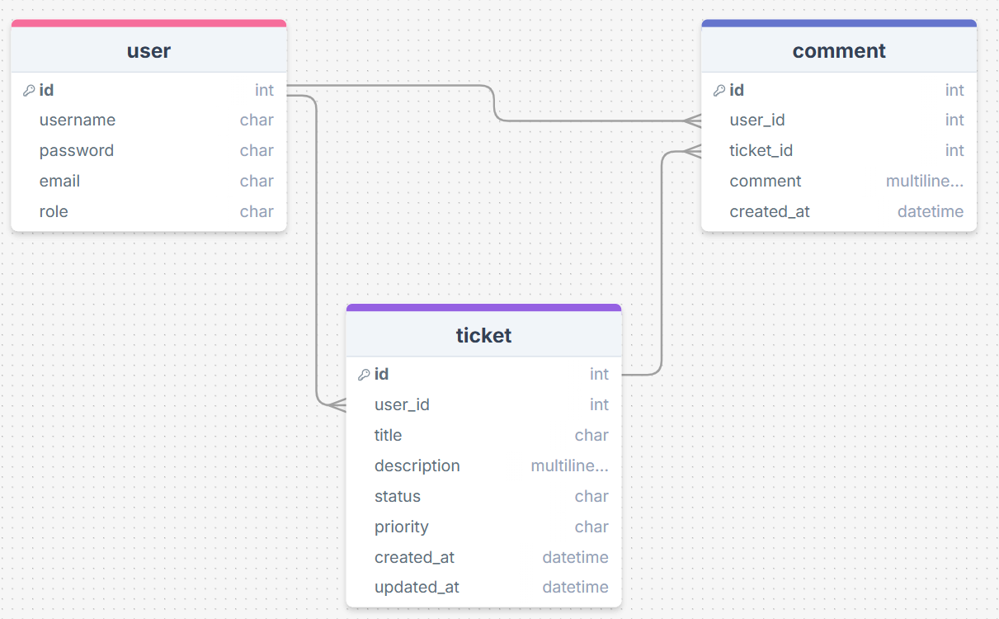

# Table of Contents

- [Setting up the Application](#setting-up-the-application)
- [App Use](#app-use)
  - [Log-in](#log-in)

This repository contains the code for Activity 1 of the assignment. Please follow the instructions below to set up and execute the application:

# Setting up the Application

- Create a virtual environment: `python -m venv venv`

- Install dependencies: `pip install -r requirements.txt`

- Create a `.env` file and add any value e.g. `SECRET_KEY = 'flask_secret_key_123'`

# App Use:

## Log-in

There are 10 user records generated automatically. There are 9 users and 1 admin. The details are as follow:

- User:

```
username: user1
password: user1
```

- Admin:

```
username: admin
password: admin123
```

# App Documentation:

This app aims to simulate an IT Support app where a user can raise a ticked and an IT Support officer will aim to resolve them. There are 3 tables, User, Ticket, and Comment

## Entity Relationship Diagram:


